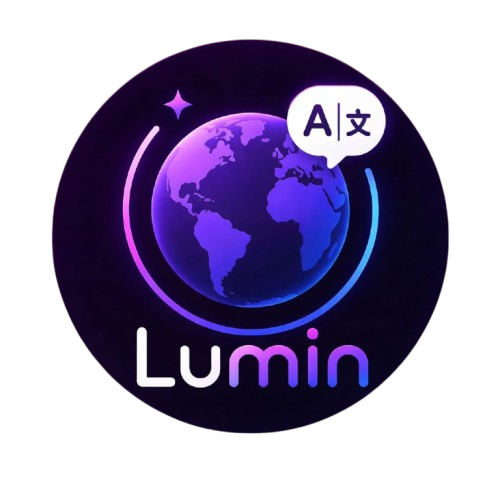

  

## Sobre o Projeto

O **Lumin** é um aplicativo de aprendizado de idiomas que transforma o seu dia a dia em uma sala de aula.  
Com a câmera do celular, o app traduz objetos do mundo real em tempo real, conectando o que você vê ao vocabulário em outro idioma (ex: “mesa” → “table” sobre o objeto real).

O objetivo é ajudar as pessoas a aprender vocabulário de forma natural, usando o contexto visual do cotidiano (casa, rua, escola, trabalho), sem depender apenas de listas de palavras.

---

## Stack Principal

#### Languages and Frameworks:

#### Database:

#### Tools:

---

## Funcionalidades

- (Em desenvolvimento)

---

## Como rodar:

- (Em desenvolvimento)

---

## Equipe de Desenvolvedores

- Antonio Sena - https://github.com/AntonioSena0
- Arthur Gutemberg - https://github.com/ArthurGutemberg9
- Beatriz Galdino - https://github.com/Beatriz1505
- Giovanna Torres - https://github.com/GiT0rres

---

© 2026 Lumin. Todos os direitos reservados.